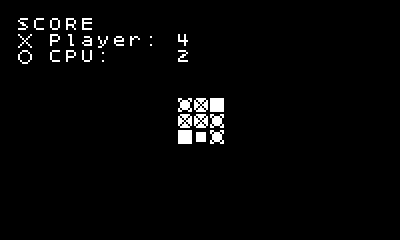

# Tic-tac-toe for [Playdate](https://play.date/)

This is a simple tic-tac-toe game created with [Pulp](https://play.date/pulp/docs/).
It was mostly an exercise to learn PulpScript.

## Know problems

* The opponent plays randomly.
Better AI could be implemented but PulpScript is not the best language for this.
* The board is tiny and does not fill the whole screen.
That's because Pulp always uses 8 px tiles.

## How to install

Download the `.zip` file in releases
and [sideload it](https://help.play.date/games/sideloading/)
to your console.
